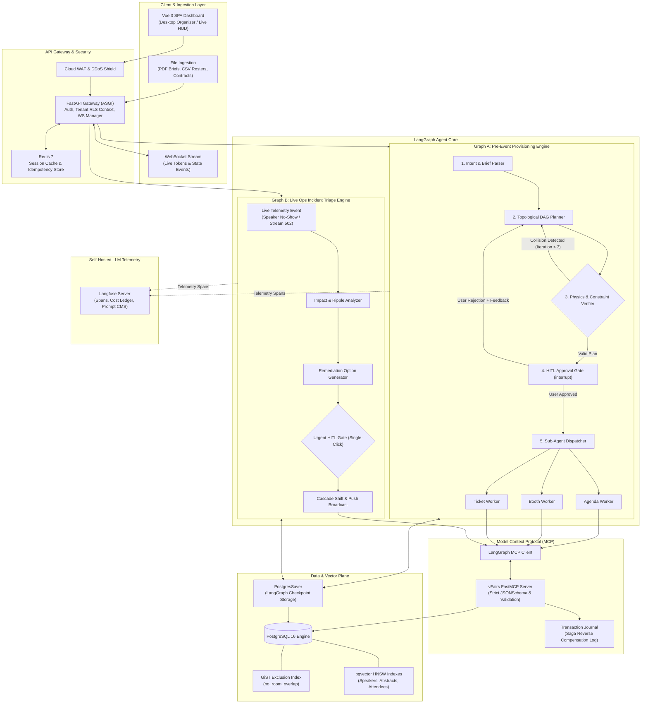
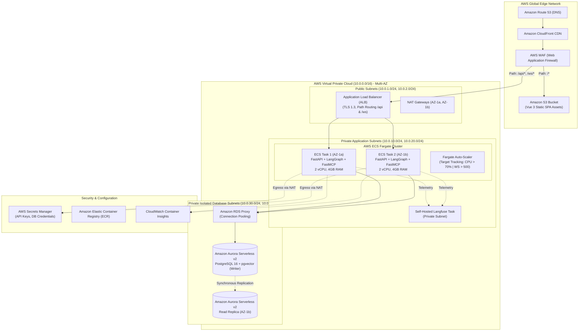
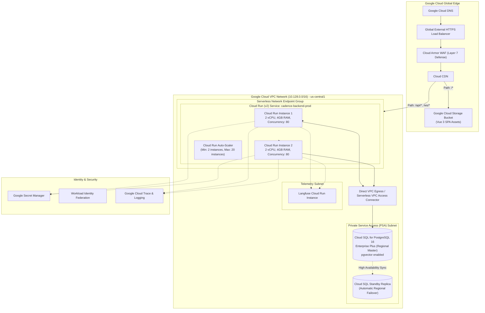
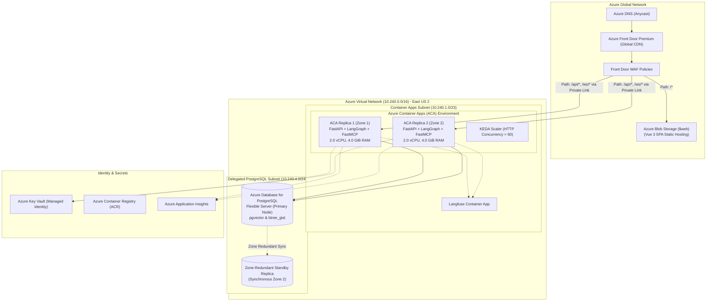
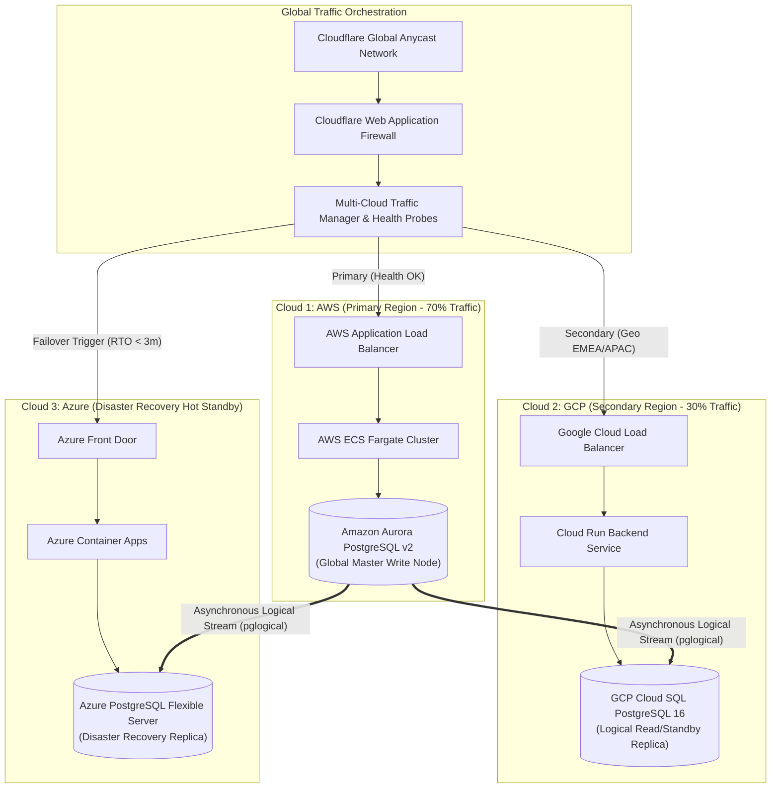
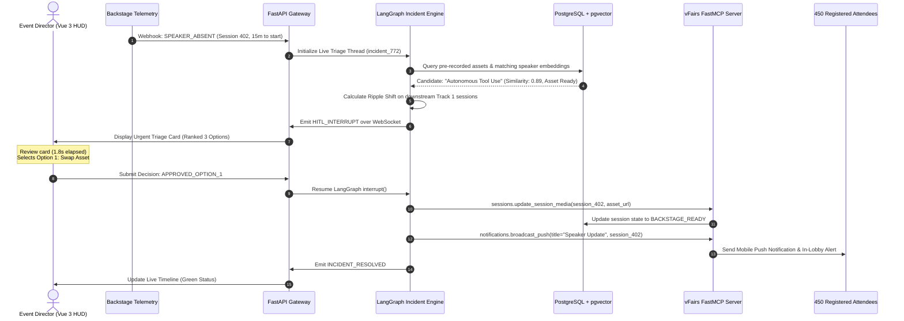

# Architectural Visual Blueprints & Cloud Topology Diagrams

**Product Name**: Cadence AI  
**Document Version**: 1.0.0  
**Status**: APPROVED & FINALIZED  
**Scope**: High-Resolution Mermaid Diagrams for AWS, GCP, Azure, Multi-Cloud Federation, and Agentic Data Flows  

---

## 1. End-to-End System & Dual-Graph Workflow

This diagram illustrates how raw inputs flow through the FastAPI gateway, LangGraph state machines, FastMCP server, and down to the persistent database.

---

## 2. AWS Native Production Deployment Architecture

---

## 3. GCP Native Production Deployment Architecture

---

## 4. Azure Native Production Deployment Architecture

---

## 5. Multi-Cloud Federation & Cross-Cloud Disaster Recovery Topology

---

## 6. Live Incident Cascade Sequence Diagram

This sequence diagram illustrates how Graph B handles a real-time speaker no-show under 3 seconds:

